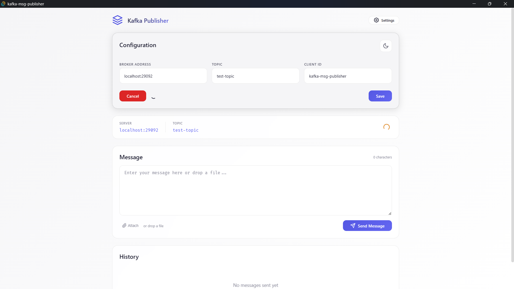

# 📨 Kafka Message Publisher

A clean, portable, and performant desktop application for sending messages to Apache Kafka. Built with **Rust**, **Tauri**, and **Angular** for a lightweight native experience.



---

## ✨ Features

| Feature | Description |
|---------|-------------|
| 🚀 **Lightweight** | Native desktop app (~15MB) with no runtime dependencies |
| 🔌 **Connection Status** | Real-time indicator showing Kafka connectivity |
| 📝 **Message Input** | Write or paste messages directly |
| 📎 **File Attach** | Load message content from local files |
| 📜 **History** | Track sent messages with success/error status |
| 🌓 **Theme Toggle** | Dark and light mode support |
| ⚡ **Timeout Handling** | Graceful error handling when Kafka is unreachable |
| 💾 **Config Persistence** | Settings saved locally between sessions |

---

## 🛠️ Tech Stack

| Layer | Technology |
|-------|------------|
| **Frontend** | Angular 20, TypeScript |
| **Desktop Runtime** | Tauri 2 (Rust) |
| **Kafka Client** | rskafka (pure Rust, no C dependencies) |
| **Styling** | Custom CSS with glassmorphism |

---

## 🚀 Getting Started

### Prerequisites

- [Node.js](https://nodejs.org/) (v18+)
- [Rust](https://rustup.rs/) (stable)
- A running Kafka broker (for testing)

### Development

```bash
# Install dependencies
npm install

# Run in development mode
npm run tauri dev
```

### Build for Production

```bash
# Build the executable
npm run tauri build
```

The installer will be generated in:
- **Windows**: `src-tauri/target/release/bundle/nsis/` or `msi/`
- **macOS**: `src-tauri/target/release/bundle/dmg/`
- **Linux**: `src-tauri/target/release/bundle/deb/` or `appimage/`

---

## 📖 Usage

1. **Configure** - Click Settings to enter your Kafka broker address and topic
2. **Test Connection** - Verify the broker is reachable (3s timeout)
3. **Send Messages** - Type or attach a file, then click Send
4. **View History** - Track all sent messages with status indicators

### Keyboard Shortcuts

| Shortcut | Action |
|----------|--------|
| `Ctrl+Enter` | Send message (coming soon) |

---

## ⚙️ Configuration

Settings are persisted to:
- **Windows**: `%APPDATA%/kafka-msg-publisher/config.json`
- **macOS**: `~/Library/Application Support/kafka-msg-publisher/config.json`
- **Linux**: `~/.config/kafka-msg-publisher/config.json`

### Config Options

```json
{
  "broker": "localhost:9092",
  "topic": "my-topic",
  "client_id": "kafka-msg-publisher"
}
```

---

## 🤝 Contributing

Contributions are welcome! Feel free to open issues or submit PRs.

---

## 📄 License

MIT License - see [LICENSE](LICENSE) for details.

---

<p align="center">
  Made with ❤️ using Rust + Tauri + Angular
</p>
